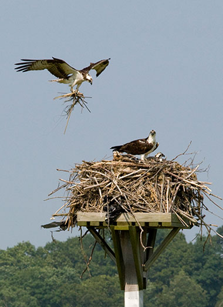

```{r setup, include=FALSE}
knitr::opts_chunk$set(echo = FALSE)

# load packages

## manipulate data, create plots
library(tidyverse)

## open file paths
library(here)

## clean column names
library(janitor)

## combine plots
library(patchwork)

## color palettes for plots
library(paletteer)

## kable table styles
library(kableExtra)

## Interactive maps
library(plotly)
```

<div class='project-page-wrapper'>

Source for data and Osprey Nation 2020 report: <https://www.ctaudubon.org/osprey-nation-home/>

## Osprey Nation

The CT Audobon's Osprey Nation is a citizen-science project launched in 2014 that collects data on Osprey nesting in Connecticut every year. As such, the initiative relies on volunteer stewards to monitor the vast number of nests in Connecticut, with a record 733 monitored in 2020 despite the COVID-19 pandemic. Stewards collect and send in data on osprey arrival dates each spring, nest locations, nesting success, and departure dates.

### Stewards

```{r}
# Create data frame columns
year = c(2014:2020)
stewards = c(100, 146, 224, 287, 314, 342, 231)
nests_with_data = c(174, 322, 420, 540, 603, 732, 733)
active_nests = c(210, 250, 337, 394, 416, 501, 510)
fledglings = c(NA, 356, 490, 607, 725, 650, "549/744 estimated")
fledlings_per_nest = c(NA, 0.69, 0.80, 0.89, 0.93, 0.81, NA)

# Create data frame
df <- data.frame(year, stewards, nests_with_data, active_nests, fledglings, fledlings_per_nest)

# Make NA values blank
opts <- options(knitr.kable.NA = "")

# Create center aligned data table
knitr::kable(df, align = "cccccc")
```

The table above shows the progression of the Osprey Nation project over time. Notably, 2020 saw a decrease in stewards and fledglings observed due to difficulties with participation during the COVID-19 pandemic.

## Ospreys in Connecticut

```{html}
<figure>



<figcaption>
  
Ospreys in Essex Land Trust.

</figcaption>

</figure>
```

According to the CT DEEP, the osprey population in Connecticut reached a record low of only 9 active nests in 1974. The population suffered from pressure due to coastal development and DDT contamination causing eggshell thinning. Since the banning of DDT and restrictions on other pesticides in the 1970s, their population in the state has steadily been on the rise.

Source: <https://portal.ct.gov/DEEP/Wildlife/Fact-Sheets/Osprey>

## Loading the Data

Along with the annual report, Osprey Nation publishes data on nest locations, type, stewards, monitored status, and description.

Here is the interactive data map provided on the Osprey Nation website:

<iframe src="https://www.google.com/maps/d/embed?mid=1Ryu5cu-Xl8g2f10yxbB37S0JmeqWnJGR" width="640" height="480">

</iframe>

I downloaded the data from the map above as a `.kmz` file, which I loaded in `QGIS`. To create the subset of only Old Lyme nests, I created a buffer of the town boundary and used the `Select by location` tool in the QGIS Processing Toolbox. This could have also been achieved in `R` by filtering on the `name` column of the `all_nests` data set, since all Old Lyme nests begin with "Old Lyme".

```{r}
# Load all nests dataset
all_nests <- read.csv(file = "data/All_Nests.csv") %>% 
  clean_names() %>% 
  rename("x2021_status" = 19) %>% 
  select(-(description:icon)) 

# load old lyme data only
ol_nests <- read.csv(file = "data/OL-Only_Nests.csv") %>% 
  clean_names() %>% 
  rename("x2021_status" = 19) %>% 
  select(-(descriptio:icon))
```

## Ospreys in Old Lyme, CT

For this blog, I am looking at the town of Old Lyme, CT. This is for a few reasons...

1.  Old Lyme is my hometown!
2.  ~10% of nests in the state are found in the town's coastline and rivers.
3.  Great Island and the Lower Connecticut River Valley area are important ecological and conservation areas. The CT Audobon reports that the greatest concentration of Osprey nests in the state is on Great Island.

Of the 231 stewards that volunteered for the project in 2020, there were `r length(unique(ol_nests$x2021_stewa)) - 1` unique stewards who collected data in Old Lyme.

## Visualizing the Data

First, I wanted to see how many nests were actively monitored in 2020.

```{r}
# ALL NESTS

# create data set with counts of nests by monitored status
all_nests_monitored <- all_nests %>% 
  
  # select only monitored status column
  select(monitored_y_n) %>% 
  
  # count by monitored status
  group_by(monitored_y_n) %>% 
  summarize(count = n()) %>%
  
  # Add dummy year value for plot
  mutate(year = "2020") %>% 
  
  # Add proportion of total
  mutate(freq = round(count / sum(count), 2))

# plot monitored status
all <- ggplot(data = all_nests_monitored, aes(x = year, y = freq, fill = monitored_y_n, label = freq)) +
  geom_col(position = "fill", stat = "identity") +
  geom_text(size = 2.5, position = position_stack(vjust = 0.5)) +
  scale_fill_manual(values = c("#fdb813", "#0079c2")) +
  theme(
    legend.position = "none",
    panel.background = element_blank(),
    axis.text.y = element_blank(),
    axis.ticks.y = element_blank(),
    axis.title.y = element_blank(),
    axis.text.x = element_blank(),
    #axis.ticks.x = element_blank(),
    axis.title.x = element_text(),
    plot.margin = margin(0,0,0,0,"pt")
  ) + 
  labs(x = "All Nests")
  
# OLD LYME ONLY

# create data set with counts of nests by monitored status
ol_nests_monitored <- ol_nests %>% 
  
  # select only monitored status column
  select(monitored) %>% 
  
  # count by monitored status
  group_by(monitored) %>% 
  summarize(count = n()) %>%
  
  # Add dummy year value for plot
  mutate(year = "2020") %>% 
  
  # Add proportion of total
  mutate(freq = round(count / sum(count), 2))


# plot monitored status
ol <- ggplot(data = ol_nests_monitored, aes(x = year, y = freq, fill = monitored, label = freq)) +
  geom_col(position = "fill", stat = "identity") +
  geom_text(size = 2.5, position = position_stack(vjust = 0.5)) +
  scale_fill_manual(values = c("#fdb813", "#0079c2")) +
  theme(
    legend.title = element_blank(),
    panel.background = element_blank(),
    axis.text.y = element_blank(),
    axis.ticks.y = element_blank(),
    axis.title.y = element_blank(),
    axis.text.x = element_blank(),
    #axis.ticks.x = element_blank(),
    axis.title.x = element_text(),
    plot.margin = margin(0,0,0,0,"pt")
  ) + 
  labs(x = "Old Lyme Nests")

all + ol +
  plot_annotation(title = "What Percent of Nests Were Actively Monitored in 2020?",
                  theme = theme(plot.title = element_text(hjust = 0.5)))
```

In my datasets, there are `r dim(all_nests)[1]` total nests and `r dim(ol_nests)[1]` nests in Old Lyme. This plot shows that 91% of these nests in the entire state and 96% of nests in Old Lyme were actively monitored in 2020.

Next, let's look at the types of nests that exist. Looking at the data set of all 958 nests in Connecticut, there are a staggering **200** unique nest types entered by stewards (after accounting for capitalization and white space). Many of these are different ways of saying the same thing: For example, a light pole could be entered as light post, electric pole, utility pole, on a light pole, light tower, light fixture, etc. In addition, some nest types included notes, such as dates that platforms were built or "difficult to see".

Instead of re-categorizing all of these nests here, I will simply highlight the most common nest types and the need for standardization of this column in future years.

```{r}
all_nest_types <- all_nests %>% 
  
  # select only nest type column
  select(nest_type) %>% 
  
  # remove blanks
  filter(nest_type != "") %>% 
  
  # aggregate strings with different cases and white space
  mutate(nest_type = tolower(nest_type)) %>% 
  mutate(nest_type = trimws(nest_type)) %>% 
  
  # count by nest type
  group_by(nest_type) %>% 
  summarize(count = n()) %>% 
  
  # only show top 10 most common nest types
  arrange(desc(count)) %>% 
  slice(1:10)

ggplot(data = all_nest_types, aes(x = count, y = reorder(nest_type, count), fill = nest_type)) +
  geom_col() +
  geom_text(aes(label = count), vjust = 0.5, hjust = -.5, size = 2.5) +
  scale_fill_paletteer_d("RColorBrewer::Paired") +
  theme_minimal() +
  theme(
    legend.position = "none",
    axis.title.y = element_blank(),
    axis.text.y = element_text(margin = margin(t = 0, r = -15, b = 0, l = 0, unit = "pt")),
    panel.grid.major.y = element_blank()
  ) +
  labs(
    title = "What Are The Top 10 Most Common Nest Types?",
    x = "Count"
  )

```

This plot shows that **platform** nests are by far the most common nest type, making up \~`r round((335 / 958) * 100, 0)`% of all nests. It is important to note that **191** nests had no data on nest type, representing \~`r round((191 / 958) * 100, 0)`% of all nests.

```{r}
ol_nest_types <- ol_nests %>% 
  
  # select only nest type column
  select(nest_type) %>%
  
  # aggregate strings with different cases and white space
  mutate(nest_type = tolower(nest_type)) %>% 
  mutate(nest_type = trimws(nest_type)) %>% 
  
  # count by nest type
  group_by(nest_type) %>% 
  summarize(count = n()) %>% 
  
  # arrange by count desc
  arrange(desc(count))
```

60 of the 95 nests in Old Lyme had no data on nest type, making up \~`r round((60 / 191) * 100, 0)`% of missing nest types despite Old Lyme only holding \~`r round((95 / 958) * 100, 0)`% of total nests. 19 of the 35 nests with data inputted were platforms, which is consistent with the overall data set.

The map below highlights the nests in Old Lyme with missing nest type data for potential data capture in the next year's report:

<figure>


<figcaption>

Map of Missing Nest Type Data in Old Lyme, CT.

</figcaption>

</figure>

Nests with missing data are spatially distributed throughout the town's coastline. This data should be collected to allow for potential analysis of the relationship between nest type and success rates of fledglings.

Finally, I want to look at the final nest status data.

<figure>


<figcaption>

Map of Nest Status at the end of the 2020 Osprey season in Old Lyme, CT.

</figcaption>

</figure>

```{r, include = FALSE}
all_nests_status <- all_nests %>% 
  
  # select only 2021 status column
  select(x2021_status) %>% 
  
  # count by nest status
  group_by(x2021_status) %>% 
  summarize(count = n()) %>% 
  
  # add a readable column for status
  mutate(status_desc = case_when(x2021_status == "AB" ~ "No Incubation",
                                 x2021_status == "A" ~ "Active",
                                 x2021_status == "S(2)" ~ "Successful (2 Fledglings)",
                                 x2021_status == "NU" ~ "Needs Update",
                                 x2021_status == "ND" ~ "No Data",
                                 x2021_status == "S(1)" ~ "Successful (1 Fledling)",
                                 x2021_status == "IF" ~ "Incubation Failure",
                                 x2021_status == "S(3)" ~ "Successful (3 Fledlings)",
                                 x2021_status == "PH" ~ "Post-Hatch Failure",
                                 x2021_status == "DR" ~ "Damaged/Removed",
                                 x2021_status == "S(4)" ~ "Successful (4 Fledglings)"))

ggplot(data = all_nests_status, aes(x = count, y = reorder(status_desc, count), fill = x2021_status)) +
  geom_col() +
  geom_text(aes(label = count), vjust = 0.5, hjust = -.5, size = 2.5) +
  scale_fill_paletteer_d("RColorBrewer::Paired") +
  theme_minimal() +
  theme(
    legend.position = "none",
    axis.title.y = element_blank(),
    axis.text.y = element_text(margin = margin(t = 0, r = -15, b = 0, l = 0, unit = "pt")),
    panel.grid.major.y = element_blank()
  ) +
  labs(
    title = "All Final Nest Status Data 2020",
    x = "Count"
  )
```

The success of the nest appears to be randomly distributed across all locations. Many sites on Great Island were left as "Active", which indicates that a final report on fledglings was not obtained. This could be due to the difficulty of access for some of these sites. 

```{r}
ol_nests_status <- ol_nests %>% 
  
  # select only 2021 status column
  select(x2021_status) %>% 
  
  # count by nest status
  group_by(x2021_status) %>% 
  summarize(count = n()) %>% 
  
  # add a readable column for status
  mutate(status_desc = case_when(x2021_status == "AB" ~ "No Incubation",
                                 x2021_status == "A" ~ "Active",
                                 x2021_status == "S(2)" ~ "Successful (2 Fledglings)",
                                 x2021_status == "NU" ~ "Needs Update",
                                 x2021_status == "ND" ~ "No Data",
                                 x2021_status == "S(1)" ~ "Successful (1 Fledling)",
                                 x2021_status == "IF" ~ "Incubation Failure",
                                 x2021_status == "S(3)" ~ "Successful (3 Fledlings)",
                                 x2021_status == "PH" ~ "Post-Hatch Failure",
                                 x2021_status == "DR" ~ "Damaged/Removed",
                                 x2021_status == "S(4)" ~ "Successful (4 Fledglings)"))

ggplot(data = ol_nests_status, aes(x = count, y = reorder(status_desc, count), fill = x2021_status)) +
  geom_col() +
  geom_text(aes(label = count), vjust = 0.5, hjust = -.5, size = 2.5) +
  scale_fill_paletteer_d("RColorBrewer::Paired") +
  theme_minimal() +
  theme(
    legend.position = "none",
    axis.title.y = element_blank(),
    axis.text.y = element_text(margin = margin(t = 0, r = -15, b = 0, l = 0, unit = "pt")),
    panel.grid.major.y = element_blank()
  ) +
  labs(
    title = "Old Lyme Final Nest Status Data 2020",
    x = "Count"
  )
```

The plot above shows the final status of nests in Old Lyme for 2020. In all, there were 16 successful nests out of the total of 95, with 30 fledglings reported and likely more unreported. In summary, Old Lyme has ~10% of the state's nests and yielded `r round((30/510) * 100,2)`% of reported fledglings.

Finally, here is a fun heat map of nest locations in the town:

<figure>


<figcaption>

Heatmap of Nests in Old Lyme, CT.

</figcaption>

</figure>

This illustrates the density of nests on and around Great Island - which holds the most nests in one place in all of Connecticut! It is evident that this area is deserving of the conservation and appreciation that it deserves.

## Recommendations

Critical information such as osprey arrival dates and departure dates are difficult to analyze as they are only included in a verbose "description" column. Key statistics like these should be saved in separate columns in order to be more useful for long-term insights.

## Reflections

This was my first attempt at an independent blog post focusing on data visualization. The main difficulty was finding the time to work on this project while balancing work and graduate school! Nonetheless, I learned a lot about integrating text, plots, and maps to tell a story. In the future, I hope to improve my skills in all three of these areas. Also, I hope to make blog posts that are more interactive.

</div>
