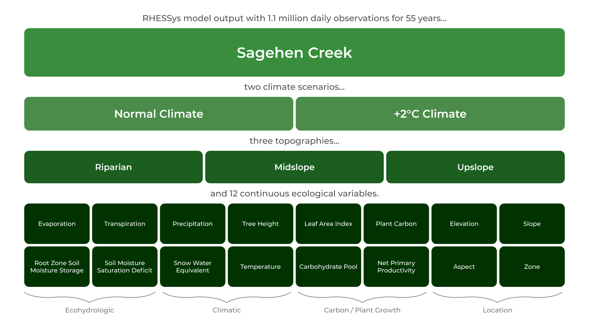

  <h3>Background</h3>

Ecohydrologic models are core tools when investigating how climate can influence water, carbon, and energy cycles in natural and urbanizing landscapes. RHESSys and other similar models are becoming increasingly sophisticated due to advances in software engineering, increased data availability, and a growing body of knowledge within the field of ecohydrology. Due to the complexity of these models, interpreting the high volume of data they output is a key challenge—both for scientists and the public. Using machine learning, researchers understanding and interpretation of model output can be enhanced and accelerated.

  

  <h3>Role</h3>
  
I collaborated with 3 peers to develop a workflow to allow researchers to quickly find patterns and relationships in RHESSys model output using machine learning tools.

  

  

  

  <h3>Skills</h3>
  
R (RStudio) RShiny GitHub Machine Learning

  

  

  

  <h3>Timeline</h3>
  
January - June 2022

  

  
This project is currently in progress. For more information prior to completion, please see the [Initial Project Proposal](files/Clippinger-Menzies_Ecohydrologic-Machine-Learning-Capstone-Proposal.pdf).

### Introduction

The Regional Hydro-Ecological Simulation System (RHESSys) is a GIS-based ecohydrologic model that assesses nutrient and water cycling at varying spatial scales. RHESSys is used by researchers to, among other applications, investigate climate change impacts on forest ecosystems. For example, [Burke et. al 2021](https://doi.org/10.3389/ffgc.2020.591162) explored fuel treatment effects on forest health and fires, and [Peng et. al 2013](https://doi.org/10.1002/jgrg.20073) analyzed the effect of timing of precipitation and snow melt recharge on stream flow.

### Problem

For my Capstone Project, I worked with the creator of RHESSys, Dr. Naomi Tague, and the Tague Team Lab at UCSB's Bren School. 

<figure>
  
  <figcaption>
Visualization of the complexity of a RHESSys dataset.
    </figcaption>
</figure>