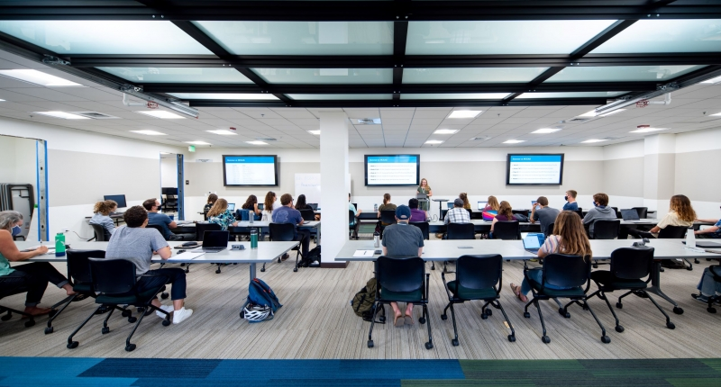

```{r setup, include=FALSE}
knitr::opts_chunk$set(echo = TRUE)
library(tidyverse)
library(palmerpenguins)
library(kableExtra)
```

<figure>



<figcaption>

My classmates and I in the brand new classroom space at the National Center for Ecological Analysis & Synthesis (NCEAS)

</figcaption>

</figure>

We are in week 3 of the Master of Environmental Data Science (MEDS) program at the Bren School of Environmental Science & Management at UCSB. So far in our summer intensive coursework, we have focused on essential math/statistics, programming (in R), and git skills that will be essential for the rest of the program. Here are a few things that we've learned...

## R functions

Since this is a data science oriented program, we quickly covered basic R syntax before moving on to learning various methods of getting data into more usable formats.

Here is a brief example of using the dplyr `group_by` and `summarize` functions to find the mean body weight (in grams) of penguin species within the [palmerpenguins](https://allisonhorst.github.io/palmerpenguins/) R data package, created by our professor [Dr. Allison Horst](https://bren.ucsb.edu/people/allison-horst)!

```{r, include = TRUE}
# Example using the palmerpenguins dataset
penguins_summary <- penguins %>% 
  group_by(species) %>% 
  summarize(mean_body_mass_g = mean(body_mass_g, na.rm = TRUE))

penguins_summary %>% kable()
```

## Essential Concepts

We have also learned fundamental ideas for working with data. One such concept is **tidy data**, which refers to the following qualities:

- Each column contains a single variable
- Each row contains a single observation
- Each cell contains a single value

This is relevant for other important topics that we've covered, such as scientific reproducibility.

## How to Create a Website!

Having a personal website to share my work through moving forward is incredibly exciting. I hope to fill this site with personal work and my data-science intensive Capstone Project that will be completed in June, 2022. 

This website is also version-controlled on [GitHub](https://github.com/alexclippinger/alexclippinger.github.io)!

## Takeaways

In the initial weeks, the MEDS program has been rewarding and challenging. I have learned to think critically and deliberately about every line of code or decision. Additionally, I can already see the profound impact that a supportive and collaborative community can make on learning this type of material. Our group of 25 students is full of inspiring and hard-working individuals from a wide variety of backgrounds, and I look forward to working together in the next year!
