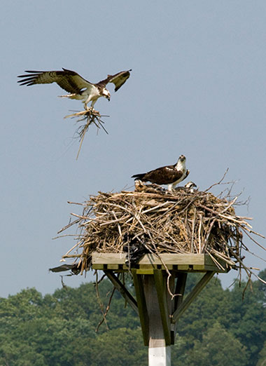

```{r setup, include=FALSE}
knitr::opts_chunk$set(echo = FALSE)

# load packages

## manipulate data, create plots
library(tidyverse)

## open file paths
library(here)

## clean column names
library(janitor)

## combine plots
library(patchwork)

## color palettes for plots
library(paletteer)

## kable table styles
library(kableExtra)
```

Source for data and Osprey Nation 2020 report: https://www.ctaudubon.org/osprey-nation-home/

# Osprey Nation

The CT Audobon's Osprey Nation is a citizen-science project intended to collect data on Osprey nesting in Connecticut every year. As such, the initiative relies on volunteer stewards to monitor the vast number of nests in Connecticut, with a record 733 monitored in 2020 despite the COVID-19 pandemic.

### Stewards

```{r}
# Create data frame columns
year = c(2014:2020)
stewards = c(100, 146, 224, 287, 314, 342, 231)
nests_with_data = c(174, 322, 420, 540, 603, 732, 733)
active_nests = c(210, 250, 337, 394, 416, 501, 510)
fledglings = c(NA, 356, 490, 607, 725, 650, "549/744 estimated")
fledlings_per_nest = c(NA, 0.69, 0.80, 0.89, 0.93, 0.81, NA)

# Create data frame
df <- data.frame(year, stewards, nests_with_data, active_nests, fledglings, fledlings_per_nest)

# Make NA values blank
opts <- options(knitr.kable.NA = "")

# Create center aligned data table
knitr::kable(df, align = "cccccc")
```


# Ospreys in Connecticut

<figure>
  
  <figcaption>Ospreys in Essex Land Trust.</figcaption>
</figure>

According to the CT DEEP, the osprey population in Connecticut reached a record low of only 9 active nests in 1974. The population suffered from pressure due to coastal development and DDT contamination causing eggshell thinning. Since the banning of DDT and restrictions on other pesticides in the 1970s, their population in the state has steadily been on the rise. 

Source: https://portal.ct.gov/DEEP/Wildlife/Fact-Sheets/Osprey


Intro to blog (compare single town to overall CT data)...

Let's take a look at the data:

```{r}
# Load all nests dataset
all_nests <- read.csv(file = "data/All_Nests.csv") %>% 
  clean_names() %>% 
  rename("x2021_status" = 19) %>% 
  select(-(description:icon))

# load old lyme data only
ol_nests <- read.csv(file = "data/OL-Only_Nests.csv") %>% 
  clean_names() %>% 
  rename("x2021_status" = 19) %>% 
  select(-(descriptio:icon))
```

```{r}
# create data set with counts of nests by monitored status
all_nests_monitored <- all_nests %>% 
  
  # select only monitored status column
  select(monitored_y_n) %>% 
  
  # count by monitored status
  group_by(monitored_y_n) %>% 
  summarize(count = n())

# plot monitored status
ggplot(data = all_nests_monitored, aes(x = count, y = monitored_y_n, fill = monitored_y_n)) +
  geom_col() + 
  theme_minimal() 
  
```

```{r}
# create data set with counts of nests in Old Lyme by monitored status
ol_nests_monitored <- ol_nests %>% 
  
  # select only monitored status column
  select(monitored) %>% 
  
  # count by monitored status
  group_by(monitored) %>% 
  summarize(count = n())

# plot monitored status in Old Lyme
ggplot(data = ol_nests_monitored, aes(x = count, y = monitored, fill = monitored)) +
  geom_col() + 
  theme_minimal()
```

```{r}
all_nest_types <- all_nests %>% 
  
  # select only nest type column
  select(nest_type) %>% 
  
  # aggregate strings with different cases and white space
  mutate(nest_type = tolower(nest_type)) %>% 
  mutate(nest_type = trimws(nest_type)) %>% 
  
  # count by nest type
  group_by(nest_type) %>% 
  summarize(count = n()) %>% 
  
  # only show top 10 most common nest types
  arrange(desc(count)) %>% 
  slice(1:10)

ggplot(data = all_nest_types, aes(x = count, y = nest_type, fill = nest_type)) +
  geom_col() +
  theme_minimal()

```

```{r}
ol_nest_types <- ol_nests %>% 
  
  # select only nest type column
  select(nest_type) %>% 
  
  # aggregate strings with different cases and white space
  mutate(nest_type = tolower(nest_type)) %>% 
  mutate(nest_type = trimws(nest_type)) %>% 
  
  # count by nest type
  group_by(nest_type) %>% 
  summarize(count = n()) %>% 
  
  # arrange by count desc
  arrange(desc(count))

ggplot(data = ol_nest_types, aes(x = count, y = nest_type, fill = nest_type)) +
  geom_col() +
  theme_minimal()

```


```{r}
all_nests_status <- all_nests %>% 
  
  # select only 2021 status column
  select(x2021_status) %>% 
  
  # count by nest status
  group_by(x2021_status) %>% 
  summarize(count = n())

ggplot(data = all_nests_status, aes(x = count, y = x2021_status, fill = x2021_status)) +
  geom_col() +
  theme_minimal()
```

```{r}
ol_nests_status <- ol_nests %>% 
  
  # select only 2021 status column
  select(x2021_status) %>% 
  
  # count by nest status
  group_by(x2021_status) %>% 
  summarize(count = n())

ggplot(data = ol_nests_status, aes(x = count, y = x2021_status, fill = x2021_status)) +
  geom_col() +
  theme_minimal()
```


