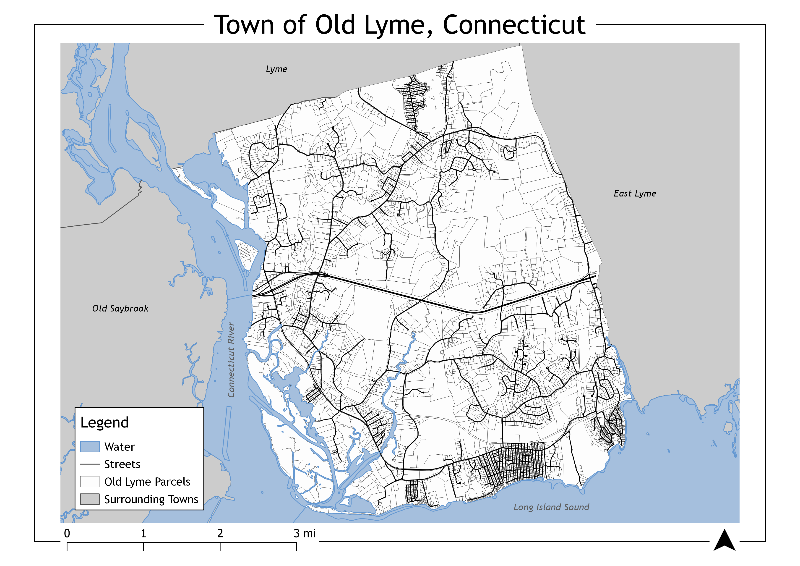
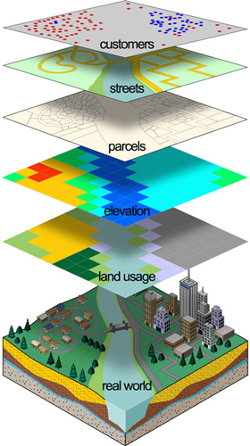

```{r setup, include=FALSE}
knitr::opts_chunk$set(echo = TRUE,
                      message = FALSE, 
                      warning = FALSE, 
                      include = TRUE)
```

## Background

In 2020, I was a GIS Volunteer with the Old Lyme Land Trust (OLLT). This blog post details a project conducted for the land trust in April 2020, which was delivered to board members.

The OLLT is a non-profit organization dedicated to conserving land and water resources for the public of Old Lyme, a coastal town in Southeastern Connecticut. Local land trusts like the OLLT are vital to natural resource conservation and education in the lower Connecticut River region. This area was identified by the Nature Conservancy as a focal area in their “Resilient Sites for Terrestrial Conservation in the Northeast and Mid-Atlantic Region” report (Burns, 2018).

<figure>
  
  
    <figcaption>
Maps depicting the location of Old Lyme, Connecticut. The town is located in Southeastern Connecticut at the mouth of the Connecticut River.
    </figcaption>
</figure>

The OLLT currently protects 70 properties covering roughly 1,100 of 16,000 acres of land in the town and is continuously seeking new acquisitions (Old Lyme Land Trust, n.d.). Currently, these efforts are primarily placed on parcels that are adjacent to existing preserves or town open space, with a goal of linking these properties to create town-wide trail systems and wildlife corridors. However, there is not a comprehensive understanding of the spatial distribution of important natural resources.

## Analysis Plan

This project aims to address this lack of insight into areas and parcels in Old Lyme with a high concentration of natural resources and thus an increased priority for conservation efforts. Taking into consideration both key natural resources criteria and OLLT Board Member concerns, the results will provide a basis for acquisition targets and support for grant applications. These criteria will be weighted and combined using a GIS overlay analysis. 

In all, the project will answer two principal questions:

1. What is the distribution of key natural resources in town?

2. Which parcels contain high values of natural resources and other conservation criteria?

## Overlay Analysis

The overlay analysis follows the standard methodology outline by Esri that can be applied in suitability modeling and optimal site selection (Esri, n.d.). These key steps include defining the problem, breaking into-sub models, determining significant layers, reclassifying these layers to be comparable, weighting based on specific project goals, then finally combining the inputs, and analyzing the results (ibid.). An overlay analysis is a common technique to apply a common scale to diverse inputs to create an integrated analysis.

<figure>
  
  
</figure>

Table 1 summarizes the sub-models, data layers, initial data types, and weights used for this analysis. Using this approach, each parcel will receive a value between 0 and 12 representing prioritization level for conservation and targeting by the land trust. The sub-models were devised by referencing the Lower CT River and Coastal Region Land Trust Exchange’s (LTE) Natural Resource Based Strategic Conservation Plan, which is a similar regional model focusing on large-scale corridor connectivity, and supported by direct feedback from OLLT Board Members.

<figure>
  
</figure>

The input layers are displayed below:

<figure>
  
</figure>

## Results

The raster layer representing the weighted matrix of natural resource criteria is seen in Map 3. The largest concentration of natural resources is in coastal and riparian zones of the Connecticut River, as well as marshy wetlands surrounding the Lieutenant and Black Hall rivers. The large forest areas in the central and North-East parts of the town also have high values. Map 4 shows the results of the parcel prioritization. Parcels in the areas listed above are of the highest conservation importance. However, some larger parcels and those close to existing Land Trust property have received a boosted focus. Notably, the large properties adjacent to the Upper Three Mile River preserve are identified as important targets. These properties are known priorities for the OLLT to complete the linkage of preserve property in that area.

Table 2 lists the highest valued parcels for conservation. All these properties are in coastal or riparian zones, with the highest concentration at the inlet of the Lieutenant River. It is quite notable that 75% of the top 20 properties are already owned and protected by the Town of Old Lyme, State of Connecticut, Old Lyme Land Trust, or Nature Conservancy, with an impressive 30% protected by the OLLT.
