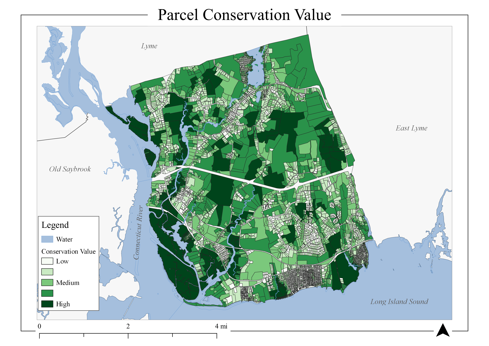

```{r setup, include=FALSE}
knitr::opts_chunk$set(echo = TRUE,
                      message = FALSE, 
                      warning = FALSE, 
                      include = TRUE)
```

## Background

In 2020, I was a GIS Volunteer with the Old Lyme Land Trust (OLLT). This blog post details a project conducted for the OLLT in April 2020, which was delivered to board members. This also served as the final project of [GIS 6320](https://catalog.northeastern.edu/graduate/professional-studies/graduate-certificate-programs/geographic-information-systems-graduate-certificate/#programrequirementstext) during my Graduate Certificate in GIS.

## Client

The OLLT is a non-profit organization dedicated to conserving land and water resources for the public of Old Lyme, a coastal town in Southeastern Connecticut. Local land trusts like the OLLT are vital to natural resource conservation and education in the lower Connecticut River region. This area was identified by the Nature Conservancy as a focal area in their “Resilient Sites for Terrestrial Conservation in the Northeast and Mid-Atlantic Region” report ([Source](https://lcrclandtrustexchange.org/InformationDocuments/LTE_Strategic_PlanFINAL091814.pdf)).

<figure>
  
  
    <figcaption>
Maps depicting the location of Old Lyme, Connecticut. The town is located in Southeastern Connecticut at the mouth of the Connecticut River.
    </figcaption>
</figure>

The OLLT protects 70 properties covering roughly 1,100 of 16,000 acres of land in the town and is continuously seeking new acquisitions ([Source](https://www.oldlymelandtrust.org/)). These efforts are primarily placed on parcels that are adjacent to existing preserves or town open space, with a goal of linking these properties to create town-wide trail systems and wildlife corridors. However, there was not a comprehensive understanding of the spatial distribution of important natural resources.

## Analysis Plan

This project aimed to address this lack of insight into areas and parcels in Old Lyme with a high concentration of natural resources and thus an increased priority for conservation efforts. Taking into consideration both key natural resources criteria and OLLT Board Member concerns, the results provided a basis for acquisition targets and support for grant applications. These criteria are weighted and combined using a GIS overlay analysis. 

In all, the project answered two principal questions:

1. What is the distribution of key natural resources in town?

2. Which parcels contain high values of natural resources and other conservation criteria?

## Overlay Analysis

The overlay analysis follows the standard methodology outline by Esri that can be applied in suitability modeling and optimal site selection ([Source](https://desktop.arcgis.com/en/arcmap/10.3/tools/spatial-analyst-toolbox/understanding-overlay-analysis.htm)). These key steps include defining the problem, breaking into-sub models, determining significant layers, reclassifying these layers to be comparable, weighting based on specific project goals, then finally combining the inputs, and analyzing the results (ibid.). An overlay analysis is a common technique to apply a common scale to diverse inputs to create an integrated analysis.

<figure>
  
    <figcaption>
      This image depicts the basic idea of an overlay analysis - aggregating values of various data layers
    </figcaption>
</figure>

Table 1 summarizes the sub-models, data layers, initial data types, and weights initially used for this analysis. Using this approach, each parcel received a value between 0 and 12 representing prioritization level for conservation and targeting by the land trust. The sub-models were devised by referencing the Lower CT River and Coastal Region Land Trust Exchange’s (LTE) [Natural Resource Based Strategic Conservation Plan](https://lcrclandtrustexchange.org/InformationDocuments/LTE_Strategic_PlanFINAL091814.pdf), which is a similar regional model focusing on large-scale corridor connectivity, and supported by direct feedback from OLLT Board Members.

<figure>
  
</figure>

After discussion with the OLLT Acquisition Lead, **geological areas** were added as another layer of interest. The final input layers are displayed below:

<figure>
  
</figure>

[Click here for the full-sized image](images/input layers 2x5_03.png)

For full details on how these data layers were processed and combined, see the Final Project Report linked at the bottom of this page.

## Results

The raster layer representing the weighted matrix of natural resource criteria is seen in the map below. 

<figure>
  
    <figcaption>
The map depicts natural resource values as a result of the overlay analysis. Particular areas of high resource values include the Lieutenant River, Black Hall River, and Great Island.
    </figcaption>
</figure>

The largest concentration of natural resources is in coastal and riparian zones of the Connecticut River, as well as marshy wetlands surrounding the Lieutenant and Black Hall rivers. The large forest areas in the central and North-East parts of the town also have high values. 

The following map shows the results of the parcel prioritization. 

<figure>
  
    <figcaption>
Parcels in darker shades of green have higher average values of natural resources. Additionally, these conservation values take into account proximity to existing protected land and parcel size.
    </figcaption>
</figure>

Fortunately, many of these parcels are existing property of the OLLT, Open Space Commission, or other agencies as shown in the map below.

<figure>
  
    <figcaption>
      This map contains the same information as previous, now including existed protected property.
    </figcaption>
</figure>

Parcels in the areas listed above (riparian and coastal zones) remain with the highest conservation importance. However, some larger parcels and those close to existing Land Trust property have received a boosted focus. Notably, the large properties adjacent to the Upper Three Mile River preserve (large OLLT preserve in the North-East of the town) are identified as important targets. These properties are known priorities for the OLLT to complete the linkage of preserve property in that area.

The table below lists the highest valued parcels for conservation. 

<figure>
  
</figure>

Parcel IDs can be searched using the [Town of Old Lyme MapGeo site](https://oldlymect.mapgeo.io/).

All of these properties are in coastal or riparian zones, with the highest concentration at the inlet of the Lieutenant River. It is quite notable that 75% of the top 20 properties are already owned and protected by the Town of Old Lyme, State of Connecticut, Old Lyme Land Trust, or Nature Conservancy, with an impressive 30% protected by the OLLT.

Here are the final outputs that resulted from this project:

- [Initial Project Proposal](images/GIS6320_Clippinger_FinalProjectProposal.pdf)

- [Final Project Report](images/OLLT_Overlay_Analysis.pdf)

- [Slide Deck for Board Members](images/Old Lyme Land Trust Conservation Prioritization.pdf)

- [Parcel Conservation Value Data](images/Conservation Values.xlsx)
